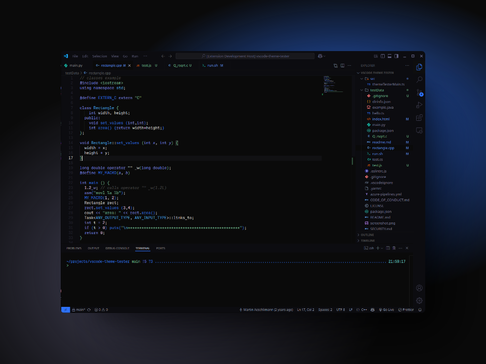

<div align="center">
    <h1>Kira Color Theme</h1>
    
    <p><i>Errors are red, functions are blue. Other theme users will be confused, not you.</i></p>
</div>




- - -

## Installation

You can install this theme via the [VSCode Marketplace](https://marketplace.visualstudio.com/items?itemName=TU_NOMBRE_DE_PUBLICACION).

Or install it manually by cloning this repository and running:

```bash
code --install-extension kira-theme.vsix
```

> Make sure you are in the directory where kira-theme.vsix is located before running the command.

## About it

Living vibrant elements over the cyberspace void.

Kira is inspired by [Tokyo Night](https://github.com/tokyo-night/tokyo-night-vscode-theme) and cyberpunk vibes generally. Also inspired by *William Gibson - Neuromancer* novel.

Kira Theme is a dark theme for VSCode designed with both an aesthetic and functional approach. Its colour palette is based on the idea of cyberspace, with a deep black background representing emptiness and an interface in shades of blue symbolising the coldness of machines.

- - -

### Main features:

- 🎨 **Optimised Kira Palette**: Kira has been created using the eponymous ‘Kira Color Palette’ colour palette of cool colours and pure black tones representing living code over the void of cyberspace.

- 📜 **Design for readability**: Designed to quickly associate each element of the code to a colour with a logical basis, avoiding red colours that we could unconsciously associate to errors or mistakes. *Blue* for functions and variables (high degree of abstraction). *Green* for strings (usually the most human element of the code) and *pink* for numbers (concrete representations).

- 📟 **Immersive interface**: Representing a window into cyberspace, the colours of *Kira* have been intentionally selected to immerse you in a cyberpunk night when programming.

- 🌙 **Less eyestrain**: Based on a balanced dark scheme with vibrant and contrast-calibrated colors (Using [Coolors Contrast Checker](https://coolors.co/contrast-checker/112a46-acc8e5)) for long coding sessions.

This theme represents my vision of the code, imbued by personal aspects such as my love for cyberpunk and the retro-futuristic vision of technology as depicted in sci-fi/action films like *Robocop*, *Demolition Man* or *Johnny Mnemonic*, which so deeply touched me.

If you want to know more about the development process of this project, I have [an article]() about that on my personal blog [*El Crisol*](https://crisol.netlify.app/).